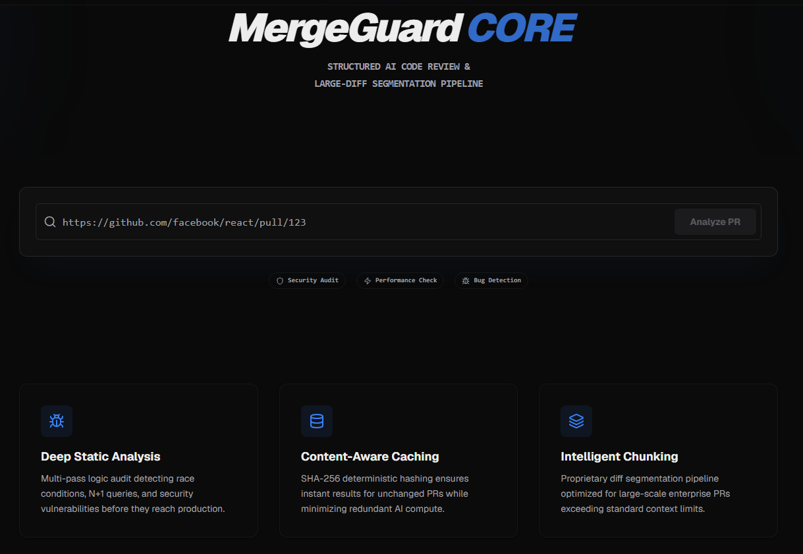
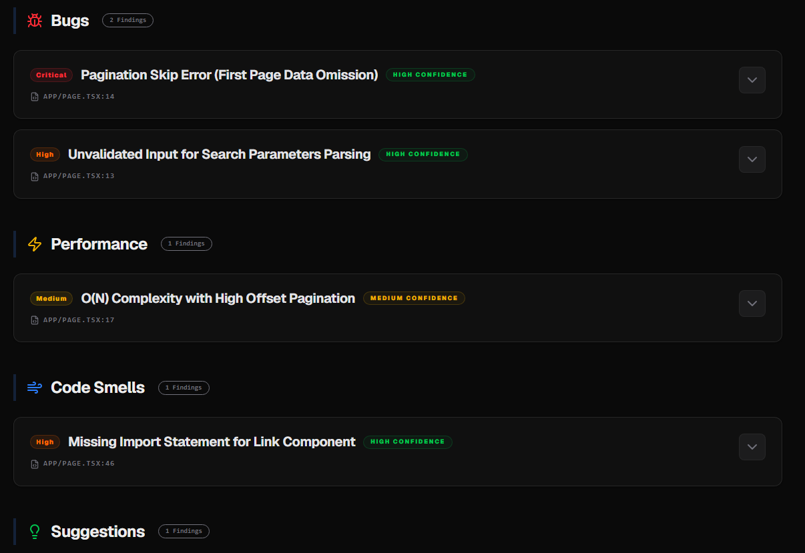
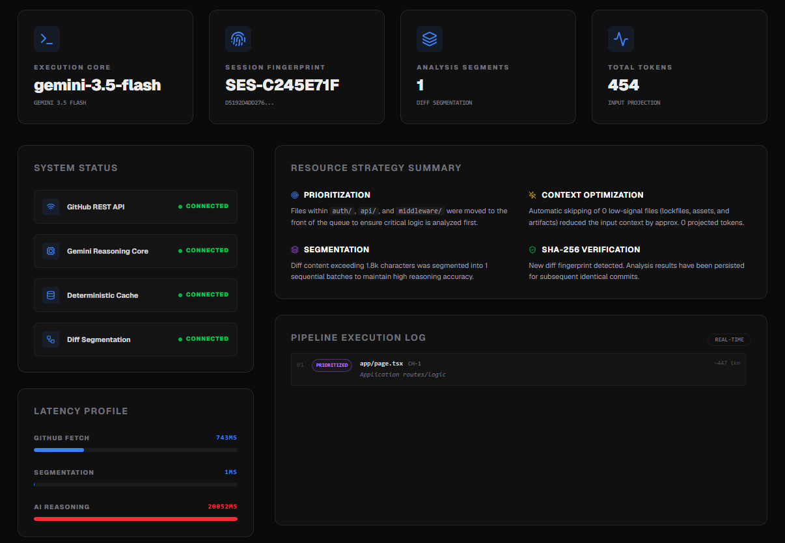
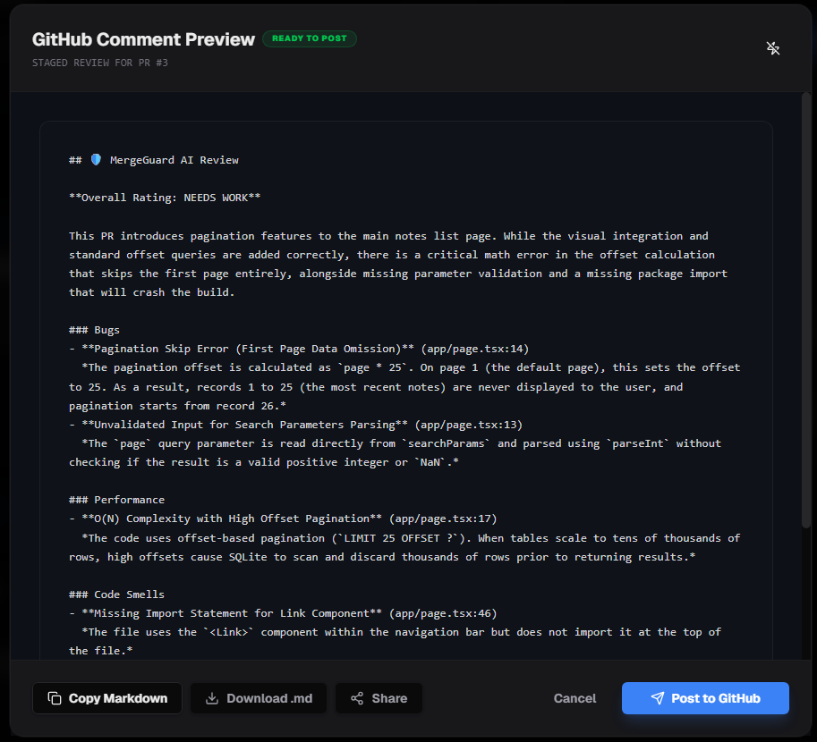

# 🛡️ MergeGuard

**Automated Infrastructure Audit & Structured AI Code Intelligence.**

[](https://hackathon.example.com)
[](https://nextjs.org/)
[](https://deepmind.google/technologies/gemini/)
[](https://www.typescriptlang.org/)

MergeGuard is a production-grade code analysis engine designed to automate GitHub Pull Request reviews. Unlike generic AI wrappers, MergeGuard implements a multi-pass technical reasoning pipeline with deterministic SHA-256 caching, intelligent diff segmentation, and deep observability. It acts as a Security Architect and Lead Engineer, delivering high-fidelity, schema-validated feedback directly to your engineering workflow.

[Live Deployment Placeholder](https://merge-guard.vercel.app) • [GitHub Repository](https://github.com/JavierChinchilla13/mergeguard-ai)

---

## 📖 Overview

Modern engineering teams face a bottleneck: as PR size grows, review quality inversely decreases. MergeGuard solves this by providing **Structured Code Intelligence**. It bypasses "AI hype" by focusing on deterministic engineering problems:

- **Diff Complexity:** Heuristically prioritizes core logic over boilerplate.
- **Context Exhaustion:** Safely segments large PRs into token-safe batches.
- **Review Fatigue:** Provides instant, categorized findings (Bugs, Security, Performance) with confidence scoring.
- **Compute Costs:** Implements content-aware caching to eliminate redundant AI reasoning for identical code states.

---

## 🏗️ System Architecture

MergeGuard is built on a stateless, event-driven pipeline optimized for low-latency streaming and high-reliability JSON extraction.

```text
[PR URL] -> [GitHub REST Service] -> [SHA-256 Fingerprinting]
                                          |
    +-------------------------------------+-----------------------------------+
    |                                                                         |
[CACHE HIT]                                                              [CACHE MISS]
Serve Persisted Report                                            [Filter & Prioritize Logic]
(Latency < 50ms)                                                              |
                                                                    [Dynamic Diff Batching]
                                                                              |
                                                                   [Gemini Multi-Pass AI]
                                                                              |
[GitHub Comment Service] <----- [Schema Validation] <----- [Structured JSON Merge]
                                          |
                                 [Observability Sink]
```

### Technical Stack

- **Frontend:** Next.js 15 (App Router) with Framer Motion for execution tracking.
- **Runtime:** Node.js (Edge-ready logic).
- **AI Engine:** Gemini 3.5 Flash (chosen for low-latency and high context-window efficiency).
- **Instrumentation:** Custom millisecond-level latency tracking for each pipeline stage.

---

## 🚀 Core Features

### 1. Deterministic SHA-256 Caching

MergeGuard hashes the incoming PR diff content using SHA-256. If the code hasn't changed, MergeGuard returns the cached analysis instantly, bypassing the AI reasoning layer. This ensures consistency and extreme performance for repeated runs on the same commit.

### 2. Intelligent Chunking Pipeline

Large PRs that exceed standard LLM context windows are processed through a segmentation pipeline.

- **Prioritization:** Files in `auth/`, `api/`, and `middleware/` are moved to the front of the queue.
- **Noise Filtering:** Lockfiles (`package-lock.json`), build artifacts, and binary assets are automatically skipped to maximize signal-to-noise ratio.

### 3. Senior-Lead AI Reasoning

Gemini is prompted with a strictly technical system-persona focused on:

- **Race Conditions** in async logic.
- **OWASP Top 10** vulnerabilities (SQLi, XSS, CSRF).
- **N+1 Queries** and React anti-patterns.
- **Technical Impact:** Every finding includes a "Production Impact" deep-dive and "Lead Recommendation" for fixing.

### 4. Engineering Observability

Full transparency into the AI's execution. The dashboard exposes:

- **Latency Instrumentation:** Breakdown of GitHub Fetch vs. AI Reasoning time.
- **Token Projection:** Real-time token usage estimation.
- **Pipeline Logs:** Detailed "Terminal-style" logs showing why specific files were prioritized or skipped.

---

## 🛠️ GitHub & Gemini Integration

### GitHub Service

- **Auth:** Uses a GitHub Personal Access Token (PAT) with minimal `repo` scope.
- **Parsing:** Automatically extracts `owner`, `repo`, and `pullNumber` from any valid PR URL.
- **Formatting:** Converts structured JSON findings into professional GitHub-flavored Markdown reports with severity badges and emojis.

### Gemini Logic

- **Model:** `gemini-3.5-flash` for its 1M+ token context and rapid inference.
- **Structured Outputs:** Uses strict JSON mode to ensure the UI can deterministically render findings without parsing errors.

```json
{
  "overallRating": "good | needs_work | critical",
  "summary": "High-level architectural impact summary...",
  "bugs": [
    {
      "title": "Uncaught Promise Rejection",
      "file": "lib/api.ts",
      "line": 42,
      "description": "Async handler lacks try/catch block.",
      "technicalReasoning": "Heuristic analysis detected missing await error boundaries.",
      "impact": "Potential server crash under load.",
      "confidence": "high",
      "recommendation": "Wrap with try/catch or use a global error handler."
    }
  ],
  "security": [],
  "performance": [],
  "codeSmells": [],
  "suggestions": []
}
```

---

## 📊 Caching & Chunking Strategy

### The Lifecycle of an Analysis

1.  **Ingest:** Fetch PR diff from GitHub.
2.  **Fingerprint:** Generate SHA-256 hash of the entire diff content.
3.  **Lookup:** Check server-side cache for existing fingerprint.
4.  **Execute (Cache Miss):**
    - Split diff into 30k token segments.
    - Prioritize "High Risk" files (e.g., `.ts`, `.py`, `.go` files in core directories).
    - Execute concurrent AI reasoning passes.
5.  **Persist:** Store merged results for subsequent calls.

**Example Latency Reduction:**

- **Cold Start (AI Run):** 8.5s - 15.0s
- **Warm Hit (Cache):** 40ms - 120ms

---

## ⚙️ Local Development Setup

### 1. Environment Variables

Create a `.env.local` file:

```env
GITHUB_TOKEN=your_github_pat
GEMINI_API_KEY=your_google_ai_studio_key
GEMINI_MODEL=gemini-3.5-flash
```

### 2. Installation

```bash
git clone https://github.com/JavierChinchilla13/mergeguard-ai.git
cd mergeguard-ai
npm install
```

### 3. Run Development Server

```bash
npm run dev
```

---

## ⚖️ Tradeoffs & Decisions

During development, several engineering tradeoffs were made to ensure production stability:

- **Stateless over Statefull:** We chose not to implement a database for user accounts, focusing instead on **Stateless Analysis** where the PR itself is the source of truth. This reduces architectural complexity and data privacy concerns.
- **Gemini Flash over Pro:** Flash was selected for its significantly lower latency. While Pro offers deeper reasoning, Flash provides the rapid feedback loop required for real-time PR review previews.
- **Manual Triggering:** We prioritized a "Request Analysis" UI over a GitHub Webhook listener. This allows developers to control exactly when AI compute is consumed, preventing unnecessary costs on every draft save.

---

## 🖼️ Screenshots


_Initial PR input and system status dashboard._


_Structured findings categorized by severity and technical impact._


_Latency metrics and pipeline execution logs._


_Markdown report preview before posting to GitHub._

---

## 🗺️ Future Roadmap

- **Vector Memory:** Implement repository-wide vector storage to provide context-aware reviews based on existing codebase patterns.
- **Incremental Re-analysis:** Only re-analyze the specific files that changed between commits within the same PR.
- **GitHub App Integration:** Move from PAT-based auth to a full GitHub App with granular installation permissions.
- **Semantic Clustering:** Group findings by logical component rather than just severity.

---

<p align="center">
  Built for the 2026 AI Engineering Hackathon. Engineered for production.
</p>
